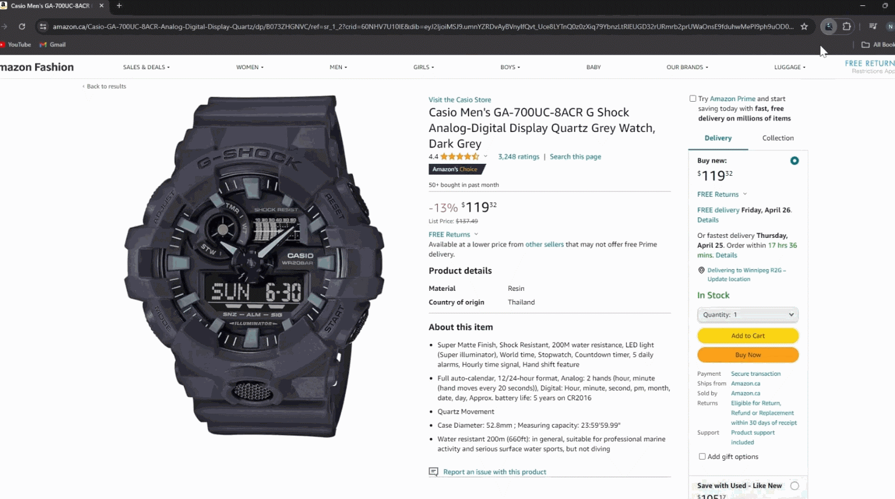

# ScreenScan - Chrome Extension

## Introduction
**ScreenScan** is a powerful Chrome extension that transforms your browsing experience by enabling you to capture, search, and explore any image, video, or text with a single click. Integrated with Google Lens, ScreenScan lets you discover more about visual content instantly.

## How It Works
🚀 **Easy to Use:**
1. Click the **ScreenScan icon** in your browser.
2. Press **"Select Area to Search"**.
3. Drag the cursor over the content you want to explore.
4. Release to see the magic happen! A new Google Images tab will open with your results, ready for further discovery.

## Perfect For
🔍 **A Variety of Users:**
- **Movie Lovers**: Identify actors and uncover film insights.
- **Language Learners**: Translate text from images on the fly.
- **E-Shoppers**: Compare prices to snag the best deals.
- **Students and Educators**: Enhance learning and teaching resources.
- **Design Aficionados**: Validate design inspirations and sources.
- **Knowledge Explorers**: Delve into detailed visuals for more information.

## Features
✨ **Powerful Tools at Your Fingertips:**
1. **Select and Search**: Identify products, translate texts, and explore the visual web with Google Lens integration.
2. **Discover Best Deals**: Compare product prices across different websites. Spot an item on Amazon? Check if it's offered at a better price elsewhere.
3. **Study Complex Information**: From math equations to historical art, use ScreenScan for quick and efficient learning.
4. **Precision at Any Scale**: Works flawlessly at any zoom level and on any display size, ensuring accurate selections.

## Installation & Usage
To start enhancing your browsing and discovery experience:
1. Install ScreenScan from the [Chrome Web Store](https://chromewebstore.google.com/detail/screenscan-instant-screen/aipbmogagldlnpfkhbkceoplgjppplac).
2. Follow the simple steps under "How It Works" to begin exploring the visual web.

## Privacy & Security
ScreenScan is committed to user privacy and does not collect or store any user data. All operations are performed locally within your browser.

## Copyright Notice
The source code of ScreenScan is private and copyrighted by me. While the source code is not publicly available, you can experience the full functionality through the deployment link on the Chrome Web Store.

